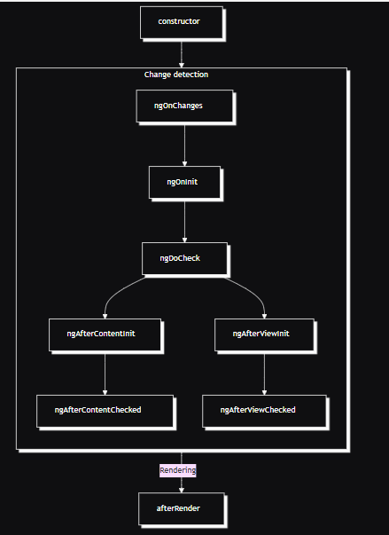
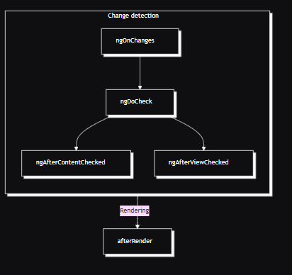

1. Tổng quan về Angular
1.1. Giới thiệu angular
- Angular là framework được tích hợp sẵn tools, làm giảm thời gian phát triển ứng dụng
-  Angular được phát triển tại goolge, phiên bản đầu tiên realease vào 10/2010 với tên angular js với các tính năng chính:
+ Dựa trên Javascript
+ Hỗ trợ kiến truc MVC
+ Tích hợp hai chiều dữ liệu(two way binding), giúp đồng bộ hóa dữ liệu giữa view & model
1.3. Kiến trúc angular
- Cấu trúc thư mục angular:
my-angular-app/
­	├── e2e/                      # Thư mục chứa mã kiểm thử end-to-end (testing hành vi người dùng)
­	├── node_modules/             # Thư mục chứa các package đã cài đặt qua npm (không commit lên git)
­	├── src/                      # Thư mục chứa toàn bộ mã nguồn ứng dụng
­	│   ├── app/                  # Thư mục chứa mã nguồn chính của ứng dụng Angular
­	│   │   ├── app.module.ts     # Module gốc (Root Module) của ứng dụng
­	│   │   ├── app.component.ts  # Component gốc (Root Component)
­	│   │   ├── app.component.html# Template HTML của component gốc
­	│   │   └── app.component.css # Style của component gốc
­	│   ├── assets/               # Chứa tài nguyên tĩnh như hình ảnh, icon, font,...
­	│   ├── environments/         # Cấu hình môi trường (dev, prod)
­	│   │   ├── environment.ts    # Cấu hình môi trường phát triển
­	│   │   └── environment.prod.ts # Cấu hình môi trường production
­	│   ├── favicon.ico           # Icon hiển thị trên trình duyệt
­	│   ├── index.html            # File HTML gốc, nơi Angular bootstrap ứng dụng
­	│   ├── main.ts               # Entry point của ứng dụng, bootstrap AppModule
­	│   ├── polyfills.ts          # Cấu hình polyfill cho trình duyệt cũ
­	│   ├── styles.css            # Style toàn cục của ứng dụng
­	│   └── test.ts               # Cấu hình cho unit test
­	├── angular.json              # Cấu hình Angular CLI (build, serve, test,...)
­	├── package.json              # Quản lý dependencies và scripts của dự án
­	├── tsconfig.json             # Cấu hình TypeScript chung cho dự án
­	├── tsconfig.app.json         # Cấu hình TypeScript cho ứng dụng
­	├── tsconfig.spec.json        # Cấu hình TypeScript cho testing
­	├── tslint.json               # Cấu hình linting cho TypeScript

- tsconfig.json
+ Xác định các tùy chọn biên dịch (compilerOptions)
+ Chỉ định các tệp hoặc thư mục được biên dịch
+ Khi có tsconfig.json trong một thư mục, thư mục đó được xem là root của dự án TypeScript, giúp trình biên dịch hiểu phạm vi và cấu trúc dự án

- ts-app-config.json: kế thừa tsconfig.json
+ kế thừa từ tsconfig.json
+ Xác định phạm vi file cần biên dịch
+ Tùy chỉnh các compilerOptions riêng cho app
+ Hỗ trợ quản lý đa ứng dụng trong workspace: Khi có nhiều ứng dụng trong cùng một workspace (ví dụ Nx hoặc Angular CLI multi-project), mỗi app có thể có file tsconfig.app.json riêng để cấu hình riêng biệt mà không ảnh hưởng lẫn nhau.

- angular.json: 
+ cấu hình ứng dụng trong workspace: port, 
- Cấu hình các mục tiêu (architect/targets) như build, serve, test, lint cho từng dự án, xác định cách thức và tham số thực thi các lệnh CLI như ng build, ng serve

- package.json:
+ meta-data application(name, description, version, license)
+ script : Thông qua các script, bạn có thể định nghĩa các lệnh phức tạp, chuỗi lệnh, hoặc gọi các công cụ build, test, deploy,... chỉ với một câu lệnh duy nhất 
+ dependencies: danh sách những package npm mà chúng ta muốn cài đặt.
+ engines: phiên bản Node.js mà ứng dụng/package của chúng ta hoạt động.
+ browserslist: các trình duyệt (và phiên bản của nó) mà ứng dụng/package của chúng ta hỗ trợ.

- package-lock.json:
Chứa cấu hình chi tiết, đảm bảo tính nhất quán và ổn định của dependency khi cài đặt (đầy đủ thông tin version các lib)

- style: xác định kiểu global cho toàn ứng dụng

- main: chứa toàn bộ ứng dụng
Khởi tạo, khởi động ứng dụng, import các thành phần cần thiết để chạy ứng dụng

- index.html:
+ File index.html trong Angular là file HTML gốc đầu tiên được trình duyệt tải khi ứng dụng khởi chạy. Đây là điểm bắt đầu của toàn bộ ứng dụng Angular
+ Chứa thẻ <app-root></app-root> (hoặc selector của root component bạn định nghĩa), đây là nơi Angular sẽ "gắn" (render) toàn bộ giao diện ứng dụng do root component quản lý

- envirotments: chứa thông tin môi trường chạy

- assets: chứa tài nguyên dùng chung images, font, ...

- app module:module gốc (root module) của ứng dụng, đóng vai trò trung tâm để khởi chạy và quản lý toàn bộ ứng dụng Angular. Đây là module đầu tiên được Angular tải và bootstrap khi ứng dụng chạy.

- node_modules: chứa thư viện, module được tải từ npm về để build hoặc biên dịch

2. Angular cơ bản

2.1. Components và templates

- Component: Component là 1 block ui(giao diện ứng dụng) trong angular
Cách tạo mới 1 component: ng g c name-component

- Component gồm 3 thành phần:
+ Một lớp TypeScript chứa logic, dữ liệu và các phương thức xử lý: tách biệt logic và giao diện, dễ dàng tha đổi hoặc tái sử dụng mà không ảnh hưởng tới giao diện
+ Một template (giao diện) định nghĩa cấu trúc HTML để hiển thị.
+ Các file CSS để định dạng giao diện.

- Component lifecycle:

+ constructor: chạy sau khi khởi tạo component
+ ngOnChanges (luôn chạy nếu có @Input thay đổi) 
+ ngOnInit (một lần duy nhất sau khi constructor khởi tạo). 
+ ngDoCheck (chạy trước khi template thay đổi). 
+ ngAfterContentInit (Chạy một lần sau khi view và các view con được khởi tạo xong). 
+ ngAfterContentChecked (mỗi lần kiểm tra nội dung). 
+ ngAfterViewInit (một lần sau khi view khởi tạo). 
+ ngAfterViewChecked (mỗi lần kiểm tra view) ? kiểm tra view ntn
+ ngOnDestroy (khi component bị hủy).

- ­	Làm thế nào để truyền dữ liệu từ component cha đến component con và ngược lại?
+ @Input 

@Component({
  selector: 'app-child',
  template: `
    
Message from parent: {{ message }}

  `
})
export class ChildComponent {
  @Input() message!: string;  // Nhận dữ liệu từ parent
}

@Component({
  selector: 'app-parent',
  template: `
    <app-child [message]="parentMessage"></app-child>
  `
})
export class ParentComponent {
  parentMessage = 'Hello from Parent!';
}
result: Message from parent: Hello from Parent!
+ @viewchild
@Component({
  selector: 'app-child',
  template: `
    
Child component content

  `
})
export class ChildComponent {
  sayHello() {
    return 'Hello from Child!';
  }
}

2.2. Template
Template là phần giao diện HTML của component, nơi bạn định nghĩa cấu trúc và cách hiển thị dữ liệu

