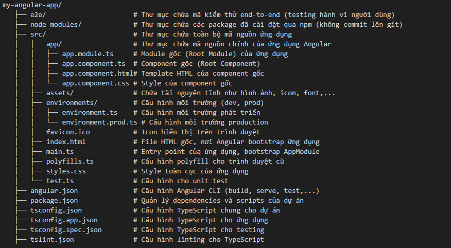
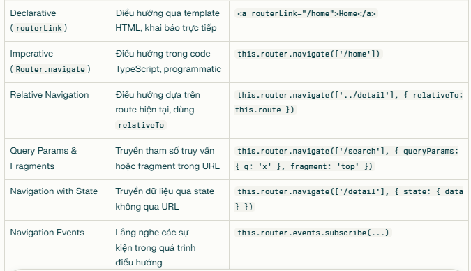
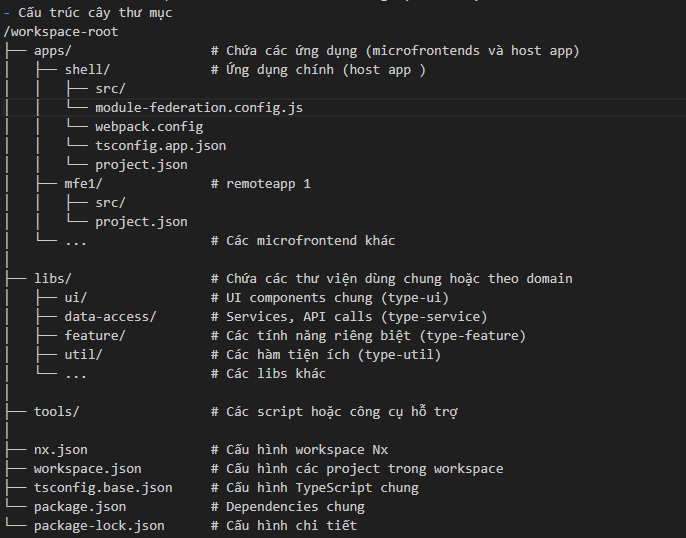

1. Tổng quan về Angular

    1.1. Giới thiệu angular
        - Angular là framework được tích hợp sẵn tools, làm giảm thời gian phát triển ứng dụng.  Angular được phát triển tại goolge, phiên bản đầu tiên realease vào 10/2010 với tên angular js với các tính năng chính:
            + Dựa trên Javascript
            + Hỗ trợ kiến truc MVC
            + Tích hợp hai chiều dữ liệu(two way binding), giúp đồng bộ hóa dữ liệu giữa view & model
        - Lợi ích của angular:

    1.3. Kiến trúc angular
        - Cấu trúc thư mục angular:
        
        - tsconfig.json
            + Xác định các tùy chọn biên dịch (compilerOptions)
            + Chỉ định các tệp hoặc thư mục được biên dịch
            + Khi có tsconfig.json trong một thư mục, thư mục đó được xem là root của dự án TypeScript, giúp trình biên dịch hiểu phạm vi và cấu trúc dự án

        - ts-app-config.json: kế thừa tsconfig.json
            + kế thừa từ tsconfig.json
            + Xác định phạm vi file cần biên dịch
            + Tùy chỉnh các compilerOptions riêng cho app
            + Hỗ trợ quản lý đa ứng dụng trong workspace: Khi có nhiều ứng dụng trong cùng một workspace (ví dụ Nx hoặc Angular CLI multi-project), mỗi app có thể có file tsconfig.app.json riêng để cấu hình riêng biệt mà không ảnh hưởng lẫn nhau.

        - angular.json:  cấu hình ứng dụng trong workspace: port, 
        - Cấu hình các mục tiêu (architect/targets) như build, serve, test, lint cho từng dự án, xác định cách thức và tham số thực thi các lệnh CLI như ng build, ng serve

        - package.json:
            + meta-data application(name, description, version, license)
            + script : Thông qua các script, bạn có thể định nghĩa các lệnh phức tạp, chuỗi lệnh, hoặc gọi các công cụ build, test, deploy,... chỉ với một câu lệnh duy nhất 
            + dependencies: danh sách những package npm mà chúng ta muốn cài đặt.
            + engines: phiên bản Node.js mà ứng dụng/package của chúng ta hoạt động.
            + browserslist: các trình duyệt (và phiên bản của nó) mà ứng dụng/package của chúng ta hỗ trợ.

        - package-lock.json: Chứa cấu hình chi tiết, đảm bảo tính nhất quán và ổn định của dependency khi cài đặt (đầy đủ thông tin version các lib)

        - style: xác định kiểu global cho toàn ứng dụng

        - main: chứa toàn bộ ứng dụng
        Khởi tạo, khởi động ứng dụng, import các thành phần cần thiết để chạy ứng dụng

        - index.html:
            + File index.html trong Angular là file HTML gốc đầu tiên được trình duyệt tải khi ứng dụng khởi chạy. Đây là điểm bắt đầu của toàn bộ ứng dụng Angular
            + Chứa thẻ <app-root></app-root> (hoặc selector của root component bạn định nghĩa), đây là nơi Angular sẽ "gắn" (render) toàn bộ giao diện ứng dụng do root component quản lý

        - envirotments: chứa thông tin môi trường chạy

        - assets: chứa tài nguyên dùng chung images, font, ...

        - app module:module gốc (root module) của ứng dụng, đóng vai trò trung tâm để khởi chạy và quản lý toàn bộ ứng dụng Angular. Đây là module đầu tiên được Angular tải và bootstrap khi ứng dụng chạy.

        - node_modules: chứa thư viện, module được tải từ npm về để build hoặc biên dịch

2. Angular cơ bản

    2.1. Components và templates

        - Component: Component là 1 block ui(giao diện ứng dụng) trong angular
        Cách tạo mới 1 component: ng g c name-component

        - Component gồm 3 thành phần:
            + Một lớp TypeScript chứa logic, dữ liệu và các phương thức xử lý: tách biệt logic và giao diện, dễ dàng tha đổi hoặc tái sử dụng mà không ảnh hưởng tới giao diện
            + Một template (giao diện) định nghĩa cấu trúc HTML để hiển thị.
            + Các file CSS để định dạng giao diện.

        - Component lifecycle:


+ constructor: chạy sau khi khởi tạo component
+ ngOnChanges (luôn chạy nếu có @Input thay đổi) 
+ ngOnInit (một lần duy nhất sau khi constructor khởi tạo). 
+ ngDoCheck (chạy trước khi template thay đổi). 
+ ngAfterContentInit (Chạy một lần sau khi view và các view con được khởi tạo xong). 
+ ngAfterContentChecked (mỗi lần kiểm tra nội dung). 
+ ngAfterViewInit (một lần sau khi view khởi tạo). 
+ ngAfterViewChecked (mỗi lần kiểm tra view) ? kiểm tra view ntn
+ ngOnDestroy (khi component bị hủy).

        - ­	Làm thế nào để truyền dữ liệu từ component cha đến component con và ngược lại?
            + @Input 

            ```@Component({
            selector: 'app-child',
            template: `
                <p>Message from parent: {{ message }}</p>
            `
            })
            export class ChildComponent {
            @Input() message!: string;  // Nhận dữ liệu từ parent
            }```

            ```@Component({
            selector: 'app-parent',
            template: `
                <app-child [message]="parentMessage"></app-child>
            `
            })
            export class ParentComponent {
            parentMessage = 'Hello from Parent!';
            }```
            result: Message from parent: Hello from Parent!
+ @viewchild

            ```@Component({
            selector: 'app-child',
            template: `
                <p>Child component content</p>
            `
            })
            export class ChildComponent {
            sayHello() {
                return 'Hello from Child!';
            }
            }```
            ```@Component({
                    selector: 'app-parent',
                    templateUrl: './parent.component.html'
                    })
                    export class ParentComponent implements AfterViewInit {
                    @ViewChild('inputRef') inputElement!: ElementRef<HTMLInputElement>;

                    ngAfterViewInit() {
                        console.log(this.inputElement.nativeElement.value); // "Initial value"
                    }

                    changeInputValue() {
                        this.inputElement.nativeElement.value = 'Changed value!';
                    }
                }```


        - Template: Template là phần giao diện HTML của component, nơi bạn định nghĩa cấu trúc và cách hiển thị dữ liệu
    2.2. Data binding
        - Data binding là kỹ thuật đồng bộ dữ liệu giữa component (logic, dữ liệu trong file TypeScript) và view (giao diện trong file HTML) trong Angular. Khi dữ liệu trong component thay đổi, view tự động cập nhật, và ngược lại khi người dùng tương tác trên view, dữ liệu trong component cũng được cập nhật tương ứng
        - Các loại databinding:
            + Interpolation ({{ expression }}): Hiển thị dữ liệu từ component lên view.
            + Property Binding ([property]="expression"): Gán giá trị từ component vào thuộc tính của phần tử trong view.
            + Event Binding ((event)="expression"): Xử lý sự kiện từ view và gọi hàm trong component.
        - Twoway binding: NgModel ([(ngModel)]="expression")

    2.3. Routing and navigation
        2.3.1. Routing trong Angular là cơ chế quản lý điều hướng giữa các view (giao diện) trong ứng dụng dạng Single Page Application (SPA). Thay vì tải lại toàn bộ trang khi chuyển sang một trang mới, Angular Router cho phép thay đổi nội dung hiển thị động dựa trên URL mà không tải lại trang, giúp trải nghiệm người dùng mượt mà hơn
            - Cách cấu hình route:
                RouterModule.forChild(loanRequestRoutes): dùng cho các tính năng, có nhiều 
                RouterModule.forRoot(loanRequestRoutes): dùng cho module gốc, chỉ tạo 1 lần

            - Tạo children route:
                ```const routes: Routes = [
                        {
                            path: 'first-component',
                            component: FirstComponent,  // Component cha, chứa <router-outlet>
                            children: [
                            {
                                path: 'child-a',
                                component: ChildAComponent  // Route con 1
                            },
                            {
                                path: 'child-b',
                                component: ChildBComponent  // Route con 2
                            }
                            ]
                        }
                        ];```

            ```<h2>First Component</h2>
                <nav>
                <ul>
                    <li><a routerLink="child-a">Child A</a></li>
                    <li><a routerLink="child-b">Child B</a></li>
                </ul>
                </nav>
                <router-outlet></router-outlet>```

            - Route parameter:
                ```const routes: Routes = [
                { path: 'articles/:id', component: ArticlesComponent }
                ];```

            - Trích xuất parameter trong router
                + snapshort: lấy 1 lần duy nhất khi component khởi tạo
                    ```import { ActivatedRoute } from '@angular/router';
                        constructor(private route: ActivatedRoute) { }
                        const id = this.route.snapshot.paramMap.get('id');```
                + Observable: mõi khi thay đổi param thì phát ra giá trị
                    Dùng trong trường hợp: khi này component đa
                    article detail dã khởi tạo, sẽ không chuyển được article khác
                    ```<div *ngIf="article$ | async as article else loadingTmpl">
                            <h1>{{ article.title }}</h1>
                            <p>{{ article.content }}</p>
                            <a *ngIf="article.id === '1'" routerLink="/article/bai-viet-2">Next</a>
                        </div>```

            - Lazy loading: Lazy Loading Modules trong Angular là một kỹ thuật giúp cải thiện hiệu suất của ứng dụng bằng cách tải các module chỉ khi chúng thực sự cần thiết
                +	{ path: 'admin', loadChildren: () => import('./admin/admin.module').then(m => m.AdminModule) }
                +	{ path: 'admin', loadComponent: () => import('./admin/admin.module').then(m => m.AdminModule) }
            loadComponent không hỗ trợ lazy load child routes trực tiếp
    
        2.3.2. Navigation
            - Declarative Navigation (Điều hướng khai báo):Sử dụng directive routerLink trong template HTML để điều hướng khi người dùng click vào liên kết.
                ```<a routerLink="/home">Trang chủ</a>
                <a [routerLink]="['/products', productId]">Chi tiết sản phẩm</a>```
            - Imperative Navigation (Điều hướng mệnh lệnh): Sử dụng các phương thức của service Router trong TypeScript để điều hướng programmatically, ví dụ khi xử lý sự kiện hoặc sau một thao tác logic.
                ```goToProduct(id: number) {
                    this.router.navigate(['/products', id]);
                    // hoặc
                    // this.router.navigateByUrl(`/products/${id}`);
                    }```
            - Relative Navigation (Điều hướng tương đối): Thường dùng khi bạn muốn điều hướng trong cùng một nhóm route con hoặc nested routes.
                ```this.router.navigate(['../details'], { relativeTo: this.route });```
            
            - Navigation Events: Angular Router phát ra các sự kiện trong quá trình điều hướng như NavigationStart, NavigationEnd, NavigationCancel, NavigationError.
            Có thể lắng nghe các sự kiện này để xử lý logic bổ sung (ví dụ: hiển thị loading spinner).
            ```this.router.events.subscribe(event => {
                if (event instanceof NavigationStart) {
                    // Bắt đầu điều hướng
                }
                if (event instanceof NavigationEnd) {
                    // Kết thúc điều hướng
                }
                });```
                
    2.4. Standalone component
    o	Standalone components là các component độc lập không cần phải khai báo trong một NgModule. Chúng có thể bao gồm cả components, directives, và pipes Giúp giảm sự phụ thuộc vào NgModule
    Nếu không dùng lazyload thì không có điểm khác biệt
    2.5  Form
        - Template-driven form: Không kiểm soát được thời điểm và tần suất gọi API, nên mỗi lần người dùng nhập ký tự mới đều có thể gọi API, dẫn đến nhiều request dư thừa.
        - Reactive form: Có thể kiểm soát tốt hơn (dùng debounceTime, distinctUntilChanged, switchMap...), giúp giảm số lần gọi API không cần thiết. Thường chỉ gọi API khi người dùng dừng nhập hoặc giá trị thực sự thay đổi.
    2.6. Directive và pipe
        - Directive: là một đối tượng giúp chúng ta dễ dàng thay đổi một đối tượng khác và cách áp dụng rất đơn giản và linh hoạt
            + Component directive
            + Structural Directives
            + Attribute Directives
        Custom directive:
```            import { Directive, ElementRef, HostListener, Input } from '@angular/core';

            @Directive({
            selector: '[appHighlight]'
            })
            export class HighlightDirective {
            @Input() appHighlight = 'yellow';

            constructor(private el: ElementRef) {}

            @HostListener('mouseenter') onMouseEnter() {
                this.el.nativeElement.style.color = this.appHighlight;
            }

            @HostListener('mouseleave') onMouseLeave() {
                this.el.nativeElement.style.color = '';
            }
            }
            @NgModule({
            declarations: [
                // ...existing components
                HighlightDirective
            ],
            // ...existing code...
            })
            export class AppModule { }
            <p appHighlight="red">Đoạn này sẽ đổi màu khi rê chuột vào!</p>```
        - Pipe trong Angular là một công cụ được sử dụng để biến đổi dữ liệu trước khi hiển thị lên template
            + Ex: <p>Today is {{ today | date }}</p>
            - Các pipe có sẵn
                +	DatePipe: Định dạng ngày tháng.
                +	UpperCasePipe và LowerCasePipe: Chuyển đổi văn bản thành chữ hoa hoặc chữ thường.
                +	CurrencyPipe: Hiển thị giá trị tiền tệ.
                +	DecimalPipe: Hiển thị số thập phân.
                +	PercentPipe: Hiển thị phần trăm (%).
                +	JsonPipe: Chuyển dữ liệu về dạng JSON.
                +	AsyncPipe: Hiển thị giá trị của Observable hoặc Promise.
                +	SlicePipe: Cắt dữ liệu của mảng hoặc chuỗi.
                +	TitleCasePipe: Chuyển đổi văn bản thành dạng tiêu đề.
            - custom pipe:
```                import { Pipe, PipeTransform } from '@angular/core';

                @Pipe({
                name: 'uppercaseAll'
                })
                export class UppercaseAllPipe implements PipeTransform {
                transform(value: string): string {
                    return value ? value.toUpperCase() : '';
                }
                }
                @NgModule({
                declarations: [
                    // ...existing components
                    UppercaseAllPipe
                ],
                // ...existing code...
                })
                export class AppModule { }
                <p>{{ 'angular store' | uppercaseAll }}</p>```
    2.7. Dependency injection
    Dependency Injection (DI) trong Angular là một thiết kế giúp tự động cung cấp (inject) các đối tượng phụ thuộc (dependencies) vào các class (component, service, directive, pipe...) thay vì tự tạo mới trong class đó.
        ```@Injectable({ providedIn: 'root' })
        export class LoggerService {
        log(message: string) {
            console.log(message);
        }
        }
        @Component({
        selector: 'app-root',
        template: `<h1>Angular DI Example</h1>`
        })
        export class AppComponent {
        constructor(private logger: LoggerService) {
            this.logger.log('AppComponent created!');
        }
        }```
        - Lợi ích
            + Tái sử dụng code: Dễ dàng dùng lại các service ở nhiều nơi.
            + Dễ kiểm thử: Có thể thay thế dependency bằng mock khi test.
            + Quản lý vòng đời: Angular quản lý việc tạo và hủy các dependency.
    2.8. RxJS và Reactive Programming
        2.8.1: Observable: Observable là một đối tượng trong thư viện RxJS (Reactive Extensions for JavaScript), dùng để quản lý và xử lý dữ liệu bất đồng bộ (asynchronous) hoặc luồng sự kiện (event streams) trong Angular.
            - Đặc điểm của Observable:
                + Cho phép phát ra nhiều giá trị theo thời gian (khác với Promise chỉ trả về một giá trị).
                + Có thể lắng nghe (subscribe) để nhận dữ liệu hoặc lỗi.
                + Hỗ trợ nhiều toán tử (operators) để biến đổi, kết hợp, lọc dữ liệu (map, filter, debounceTime, v.v.).
                + Được sử dụng nhiều trong Angular: HTTP, Form, Event, v.v.
        2.8.2:  Cách làm việc với observable
            ```import { Observable, of } from 'rxjs';

            const obs1 = of(1, 2, 3); // Observable phát ra 1, 2, 3
            const obs2 = new Observable(observer => {
            observer.next('Hello');
            observer.complete();
            });
            obs1.pipe(
            map(x => x * 2)
            ).subscribe(value => console.log(value)); // Kết quả: 2, 4, 6
            obs2.subscribe({
            next: value => console.log(value),
            error: err => console.error(err),
            complete: () => console.log('Done!')
            });

            const subscription: Subscription = obs1.subscribe(value => console.log(value));
            // Khi không cần nữa:
            subscription.unsubscribe();
            this.http.get('api/data').subscribe(data => {
            this.data = data;
            });```
            - Các operator phổ biến: 
                +	Map() Biến đổi giá trị được emit từ Observable
                +	switchMap() Sử dụng để chuyển đổi một Observable thành một Observable khác, hủy bỏ các yêu cầu trước đó nếu có
                +	pluck() Lấy một thuộc tính cụ thể từ đối tượng được emit.
                +	finalize()  Thực hiện một hành động khi Observable hoàn thành hoặc lỗi.
                +	tap() Thực hiện một hành động phụ mà không thay đổi dữ liệu được emit
        2.8.3: Subject là một loại đặc biệt của Observable trong RxJS, vừa có thể phát ra giá trị (giống Observer), vừa có thể lắng nghe giá trị (giống Observable). Subject thường dùng để chia sẻ dữ liệu hoặc sự kiện giữa các thành phần trong Angular.
            -	Plain Subject (Subject): Loại cơ bản của Subject. Không lưu trữ giá trị trước đó.
            -	BehaviorSubject: Lưu trữ giá trị cuối cùng được emit và cung cấp cho các subscriber mới.
            -	ReplaySubject: Lưu trữ một số lượng giá trị nhất định đã được emit và cung cấp cho các subscriber mới.
            -	AsyncSubject: Chỉ phát ra giá trị cuối cùng khi hoàn thành.
        2.8.5. Signal là một khái niệm mới trong Angular (từ Angular 16), dùng để quản lý trạng thái và tự động cập nhật UI khi giá trị thay đổi, tương tự như Observable nhưng đơn giản và tối ưu hơn cho reactivity.
            Đặc điểm của Signal:
            Là một hàm lưu trữ giá trị (giống biến state).
            Khi giá trị thay đổi, các nơi sử dụng signal sẽ tự động cập nhật.
            Không cần subscribe hay unsubscribe như Observable.
            Thường dùng cho UI state, form, hoặc dữ liệu nhỏ.
            ```@Component({
                selector: 'app-counter',
                template: `
                    <button (click)="increase()">Tăng</button>
                    <p>Giá trị: {{ count() }}</p>
                `
                })
                export class CounterComponent {
                count = signal(0);

                increase() {
                    this.count.set(this.count() + 1);
                }
                }```
            Signal là một hàm lưu trữ giá trị

            Bạn lấy giá trị bằng cách gọi hàm: count().
            Bạn cập nhật giá trị bằng: count.set(newValue).
            Không tự động cập nhật ngược lại từ UI

            Signal chỉ tự động cập nhật UI khi giá trị trong signal thay đổi.
            Nếu người dùng nhập liệu (input), bạn phải tự cập nhật signal (không có [(ngModel)] như binding 2 chiều).
            Không cần subscribe/unsubscribe

            Signal tự động theo dõi và cập nhật, không cần quản lý đăng ký như Observable.
            Tối ưu hiệu năng hơn

            Signal chỉ cập nhật những phần thực sự bị ảnh hưởng, giúp tối ưu hiệu năng.
    2.9. httpclient
        +	Cung cấp một API đơn giản để thực hiện các yêu cầu HTTP như GET, POST, PUT
    2.10. debug:
        + console
        + angular dev tool
3. Mirco frontEnd
    - Micro Front-End là một mô hình kiến trúc chia ứng dụng web thành các phần độc lập, mỗi phần đảm nhận một chức năng cụ thể
    -	Nx là một tập hợp các công cụ phát triển mở rộng, giúp các nhà phát triển xây dựng và quản lý dự án một cách hiệu quả, đặc biệt là trong môi trường monorepo
        + Môi trường monorepo (monolithic repository) là một kiểu tổ chức mã nguồn mà nhiều dự án (project), thư viện (library), hoặc module được lưu trữ chung trong một repository duy nhất (thường là một Git repo).
        + Đặc điểm của monorepo:
            Tất cả mã nguồn, tài nguyên, cấu hình của nhiều ứng dụng hoặc thư viện nằm chung một nơi.
            Dễ dàng chia sẻ code, tái sử dụng thư viện nội bộ.
            Quản lý version, build, test, deploy đồng bộ cho nhiều dự án.
            Dễ kiểm soát sự thay đổi ảnh hưởng đến toàn bộ hệ thống.
    -	Nx cho phép làm việc với nhiều framework như React, Angular, và Vue.js trong cùng một workspace. Điều này giúp các nhóm phát triển có thể sử dụng các công nghệ khác nhau cho từng micro front-end mà không cần phải tạo nhiều dự án riêng biệt
    
    - Module Federation là một tính năng của Webpack (từ version 5), cho phép nhiều ứng dụng (hoặc module) độc lập có thể chia sẻ, tải và sử dụng code lẫn nhau ngay tại runtime mà không cần build chung. Điều này rất hữu ích cho kiến trúc micro-frontend.

        + Static Federation (Liên kết tĩnh)
            Các remote module được cấu hình sẵn trong file cấu hình Webpack.
            Tên, URL của remote được biết trước khi build.
            // webpack.config.js
            remotes: {
            app1: 'app1@http://localhost:3001/remoteEntry.js',
            }
            Ưu điểm: Đơn giản, dễ kiểm soát, phù hợp khi remote không thay đổi.
            Nhược điểm: Không linh hoạt, phải build lại nếu remote thay đổi.

        + Dynamic Federation (Liên kết động)
            Remote module được load động tại runtime, có thể thay đổi URL, tên, hoặc điều kiện load.
            Dùng API như loadRemoteModule (Angular), hoặc tự viết logic load remoteEntry.js.
            loadRemoteModule({
            remoteEntry: 'http://localhost:3001/remoteEntry.js',
            remoteName: 'app1',
            exposedModule: './Module'
            });
            Ưu điểm: Linh hoạt, có thể thay đổi remote mà không cần build lại host.
            Nhược điểm: Cấu hình phức tạp hơn, cần xử lý lỗi khi remote không tồn tại.
            Shared Libraries (Chia sẻ thư viện)
            

    - Các ứng dụng có thể chia sẻ chung các thư viện (React, Angular, RxJS...) để giảm kích thước bundle và tránh xung đột phiên bản.
    
    - Summary:
        + Static Federation: Đơn giản, phù hợp khi remote không thay đổi.
        + Dynamic Federation: Linh hoạt, phù hợp hệ thống lớn, remote thay đổi thường xuyên.
        + Shared Libraries: Giúp tối ưu bundle và tránh xung đột thư viện.

    - Cấu trúc cây thư mục nx project:
    
    - File nx.json là file cấu hình chính của một NX workspace. Nó định nghĩa các thiết lập cho toàn bộ dự án, bao gồm:
        + Cấu hình linting và formatting: Quy định các quy tắc linting và formatting code cho toàn bộ workspace.
        + Cache: Cấu hình cách NX cache các kết quả build, test, lint, v.v. để tăng tốc độ build.
        + Task runner: Chỉ định task runner mà NX sẽ sử dụng (ví dụ: nx cloud, default).
        + Project graph: Định nghĩa các dependencies giữa các project trong workspace.
        + Generators: Cấu hình các generators để tạo code tự động.
        + Default project: Chỉ định project mặc định khi chạy các lệnh NX.
        + Plugins: Định nghĩa các plugins mà NX sẽ sử dụng.

    - File tsconfig.base.json trong một dự án NX (hoặc monorepo nói chung) là file cấu hình TypeScript cơ bản, chứa các thiết lập chung cho toàn bộ workspace. Các file tsconfig.json của từng project (ứng dụng hoặc thư viện) sẽ kế thừa từ file này.
        + Chia sẻ cấu hình: Định nghĩa các thiết lập TypeScript chung cho toàn bộ dự án, giúp đảm bảo tính nhất quán và tránh lặp lại cấu hình.
        + Paths: Cấu hình các paths để import các module từ các thư viện trong workspace một cách dễ dàng.
        + Compiler options: Thiết lập các compiler options như target, module, jsx, strict, v.v.

    - File jest.config.js dùng để cấu hình Jest, một framework testing phổ biến cho JavaScript và TypeScript. File này chứa các thiết lập cho việc chạy tests, bao gồm:
        + Transform: Xác định cách các file được chuyển đổi trước khi chạy tests (ví dụ: dùng Babel để chuyển đổi code ESNext sang ES5).
        + Module name mapper: Tạo các alias cho các module để import chúng dễ dàng hơn trong tests.
        + Test environment: Chọn môi trường chạy tests (ví dụ: node hoặc jsdom).
        + Test match: Xác định các file nào được coi là test files.
        + Coverage: Cấu hình code coverage để đo lường mức độ bao phủ của tests.
        + Reporters: Chỉ định các reporters để hiển thị kết quả tests.
        + Setup files: Chỉ định các file sẽ được chạy trước khi mỗi test suite bắt đầu.
    - eslint.config.js: ESLint là một công cụ linting code, có nghĩa là nó kiểm tra code của bạn để tìm ra các vấn đề về:
        + Coding style: Ví dụ: khoảng trắng, thụt lề, dấu chấm phẩy, v.v. (đây là phần bạn đề cập đến "format code").
        + Potential errors: Ví dụ: biến không được sử dụng, so sánh sai kiểu, v.v.
        + Code quality: Ví dụ: độ phức tạp của code, khả năng đọc hiểu, v.v.
        + Best practices: Ví dụ: sử dụng các tính năng của ngôn ngữ một cách hiệu quả, tránh các anti-patterns.
